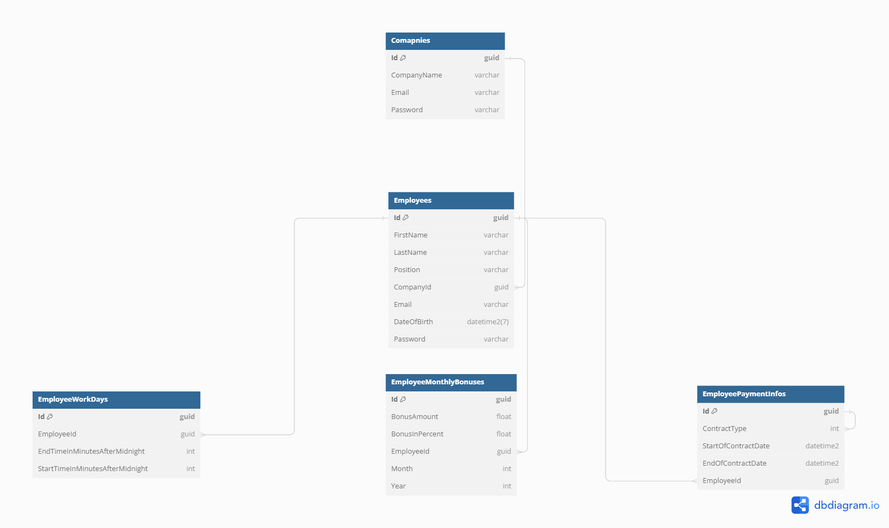

## Project Introduction
HRme is a Web API that enables companies to manage employee data. The company can: oversee employees, handle their contracts, working hours, and award bonuses for exemplary performance of duties. The program also calculates monthly compensation for users, considering their work hours hourly rates and bonuses. The application supports authentication on both the employer and employee sides, with roles taken into account to ensure that employees cannot perform actions reserved for employers. Additionally, the application features an email service, sending a message to each new employee so they receive their login credentials.

## Architrctue 
The application follows the principles of clean architecture and utilizes the Mediator and CQRS (Command Query Responsibility Segregation) patterns. JWT tokens are used for authentication, and MS SQL serves as the underlying database. The program leverages the Entity Framework Core as the Object-Relational Mapping (ORM) tool. Other libraries : FluentValidation, MediatR, AutoMapper, Bcrypt.Net . 

The program also utilizes Docker and Docker Compose, enabling easy deployment of the environment (including the database and API) and ensuring that the project will run consistently across different machines.

## Entites
To better undestand program logic i made entites schema 

